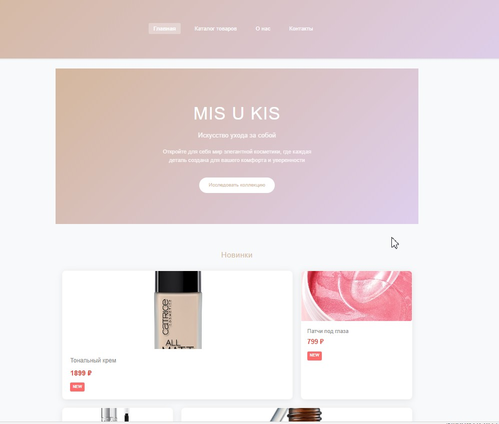
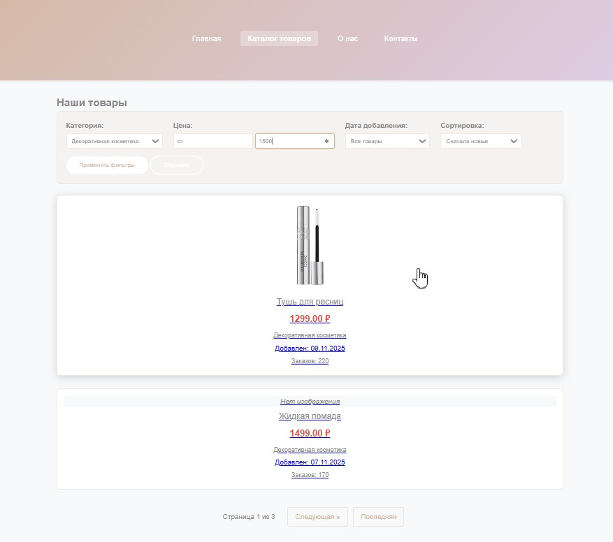
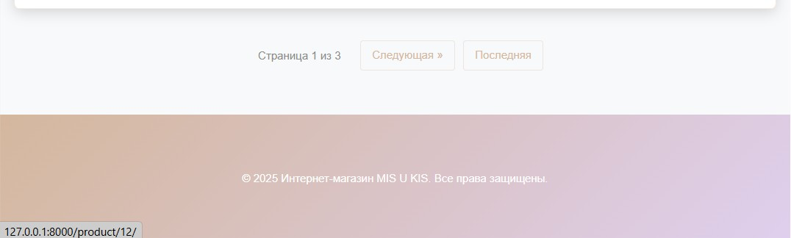

# 🛍️ Интернет-магазин с умной фильтрацией и сортировкой

<div align="center">


**Современный интернет-магазин** с продвинутой системой фильтрации, сортировки и асинхронной загрузкой товаров без перезагрузки страницы.

  [🛠 Технологии](#-технологии) • [📸 Демонстрация](#-демонстрация) • [🛠 Установка и запуск](#-установка-и-запуск) 


</div>

## ✨ Особенности

### 🎯 Основной функционал
- **Умная фильтрация** по категориям, цене и дате добавления
- **Гибкая сортировка** по популярности, цене и новизне
- **Пагинация** с навигацией по страницам
- **AJAX-подгрузка** - всё работает без перезагрузки страницы
- **Адаптивный дизайн** - выглядит отлично на всех устройствах

### 🚀 Технологии
- **Backend**: Django 4.2, Python 3.9+
- **Frontend**: JavaScript (ES6+), Bootstrap 5.2
- **База данных**: SQLite/PostgreSQL
- **Асинхронность**: Fetch API, JSON responses

## 📸 Демонстрация

### 🎨 Главная страница с товарами


*Чистый и современный интерфейс списка товаров*

### 🔍 Фильтрация и сортировка


*Мгновенная фильтрация по категориям и цене без перезагрузки*

### 📱 Адаптивный дизайн


*Идеальное отображение на мобильных устройствах*

### ⚡ AJAX-пагинация


*Быстрое переключение между страницами*

## 🛠 Установка и запуск

### 1. Клонирование репозитория
```bash
git clone https://github.com/BizziBerry/ecommerce-filtering.git
cd ecommerce-filtering
```
### 2. Создание виртуального окружения
```
bash
python -m venv venv
source venv/bin/activate  # Linux/Mac
# или
venv\Scripts\activate  # Windows
```

### 3. Установка зависимостей
```
bash
pip install -r requirements.txt
```

### 4. Настройка базы данных
```
bash
python manage.py migrate
python manage.py createsuperuser
python manage.py loaddata products.json  # демо-данные
```

### 5. Запуск сервера
```
bash
python manage.py runserver
Откройте http://localhost:8000/shop/ в браузере.
```
### 6. Запуск админ-панели
```
bash
python manage.py runserver
```
Перейти: ```http://127.0.0.1:8000/admin/```

## 🤝 Вклад в проект
- Форкните репозиторий
- Создайте ветку для фичи (git checkout -b feature/amazing-feature)
- Закомитьте изменения (git commit -m 'Add amazing feature')
- Запушьте в ветку (git push origin feature/amazing-feature)
- Откройте Pull Request

## 📄 Лицензия
MIT License - свободно используйте этот проект для обучения и разработки.

## 👥 Автор
Разработчик - BizziBerry

## 🙏 Благодарности
- Команда Django за отличный фреймворк
- Сообщество Bootstrap за красивые компоненты

<div align="center">
⭐ Если вам понравился проект, не забудьте поставить звезду!
</div>
